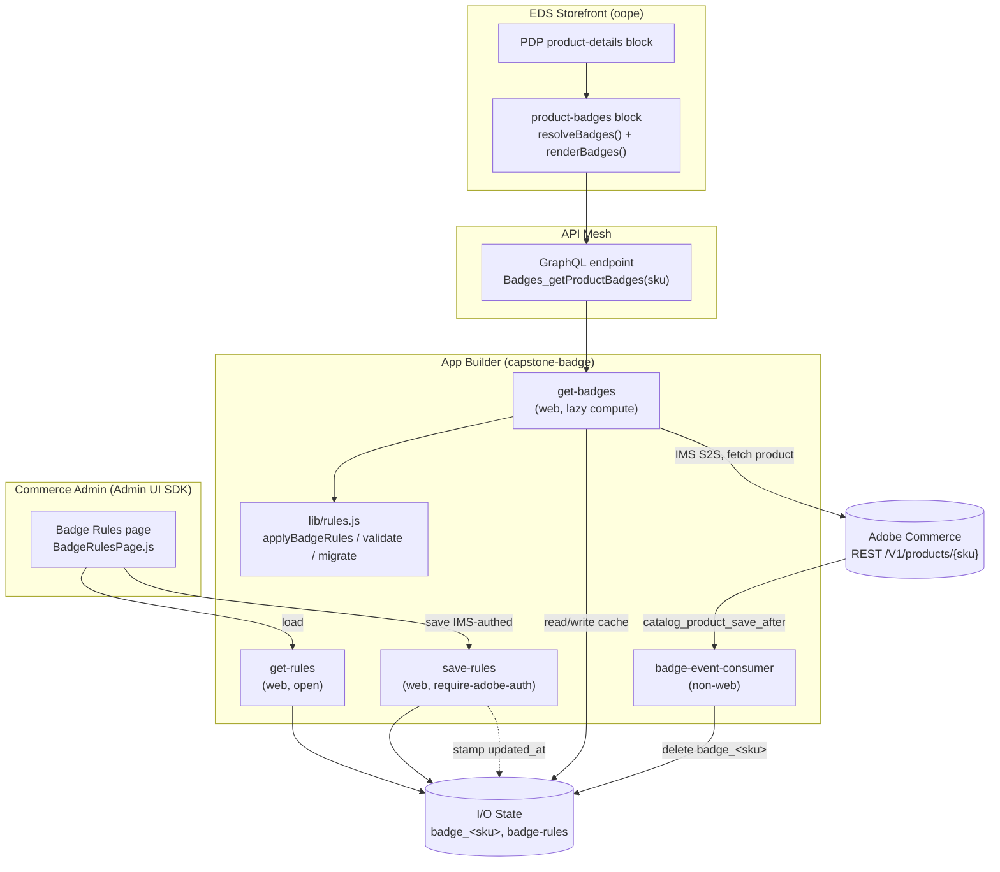

# Capstone — Dynamic PDP Product Badges (Adobe Commerce as a Cloud Service)

Out-of-process extensibility capstone for the *Develop OOP Extensibility on ACCS* cohort.
A merchant configures **badge rules** in the Commerce Admin; the storefront PDP renders
the resulting badges (e.g. *New Arrival*, *Best Seller*, *Limited Offer*, *Low Stock*, or
any **custom attribute rule**) — all driven by backend configuration, with **no core code
changes** and **no static markup**.

Everything runs out-of-process on **Adobe App Builder** (Runtime actions + Admin UI SDK),
with **API Mesh** exposing a single GraphQL field to the Edge Delivery Services (EDS)
storefront.

---

## What it does

- Merchant edits badge rules in **Commerce Admin → Badge Rules** (Admin UI SDK extension).
- Each badge is a **rule**: a label, a CSS style class, a cache TTL, and one or more
  **conditions** on product attributes, combined with **ALL** (AND) or **ANY** (OR).
- The storefront PDP asks the backend which badges apply to a SKU and renders them.
- When a product is saved in Commerce, an **I/O Events** consumer invalidates that SKU's
  cached badges so the next PDP visit recomputes them.

### Badge rule model

```
{
  id, enabled, label, style, ttlDays,
  match: "all" | "any",
  conditions: [ { field, op, value }, ... ]
}
```

- **field** — any product attribute code: `price`, `qty`, `created_at`, `special_price`,
  `sku`, `news_from_date`, or any custom attribute (`material`, `brand`, …).
- **op** — one of:

  | Operator | Meaning |
  |---|---|
  | `>` `>=` `<` `<=` | numeric comparison |
  | `=` `!=` | equals / not-equals (numeric or case-insensitive string) |
  | `contains` | case-insensitive substring |
  | `in` / `not_in` | membership in a comma-separated list |
  | `between` | inclusive range `min\|max`, open-ended ok; **polymorphic** (numbers *or* dates) |
  | `within_days` | the date field is within *N* days of now |
  | `date_reached` | the date field is now-or-earlier (empty = reached) |
  | `date_not_passed` | the date field is now-or-later (empty = not passed) |
  | `date_window_active` | Commerce "Set Product as New" window active: `news_from_date` reached **and** `news_to_date` not passed |

- **value** — comparison value (string; numbers/dates coerced as needed). Not required for
  `date_reached`, `date_not_passed`, `date_window_active`.

Default badges shipped on first run (all expressed as rules, fully editable):
*New Arrival* `= ANY(created_at within_days 30, news_from_date date_window_active)`,
*Best Seller* `= sku in [...]`, *Limited Offer* `= special_price > 0`,
*Low Stock* `= qty < 10 AND qty > 0`, *Last One* `= qty = 1`, *Out of Stock* `= qty = 0`.

---

## Architecture



### Runtime flow

1. **Read path (PDP):** EDS `product-badges` calls API Mesh → `get-badges?sku=…`.
   `get-badges` checks I/O State `badge_<sku>`. On miss/stale (rules `updated_at` newer
   than the cached entry) it fetches the product from Commerce REST via **IMS
   server-to-server** auth, runs `applyBadgeRules`, writes `badge_<sku>` (TTL = min
   `ttlDays` of matched badges), and returns `{ sku, badges, updatedAt }`.
2. **Config path (Admin):** the Badge Rules page loads via `get-rules` and persists via
   `save-rules` (IMS-authenticated). `save-rules` validates, writes `badge-rules`, and
   stamps `updated_at` — the invalidation signal for stale caches.
3. **Event path (catalog):** a product save in Commerce fires
   `observer.catalog_product_save_after` → `badge-event-consumer` deletes `badge_<sku>`,
   forcing a fresh compute on the next PDP visit.

---

## Runtime actions

| Action | Web | Auth | Purpose |
|---|---|---|---|
| `get-badges` | yes | open | Lazy-compute + cache badges for a SKU; returns matched badge IDs. |
| `get-rules` | yes | open | Return the current badge rule set (migrated to v4 in memory). |
| `save-rules` | yes | `require-adobe-auth` | Validate + persist the rule set; stamp `updated_at`. |
| `badge-event-consumer` | no | — | On `catalog_product_save_after`, invalidate `badge_<sku>`. |

`lib/rules.js` is the single source of truth shared by the actions: the rule model,
defaults, migration (v1/v2/v3 → v4), validation, badge application, and TTL calculation.

**I/O State keys:** `badge_<sku>` (per-SKU cache) and `badge-rules` (the rule set).
Keys use only `[A-Za-z0-9-_.]` — colons are not allowed, so `badge_<sku>` uses an
underscore.

---

## Repositories

| Repo | Purpose |
|---|---|
| `my-commerce-extension-capstone` (this repo) | App Builder: badge actions + Admin UI SDK Badge Rules page + API Mesh config. |
| `oope` | EDS storefront; `blocks/product-badges` + `blocks/product-details` render the badges. |

---

## Setup / reproduce

### Prerequisites
- Adobe Developer Console project + workspace with **App Builder**, **I/O Management**,
  and **I/O Events** services.
- An **OAuth Server-to-Server** credential with Commerce API scopes.
- Adobe Commerce as a Cloud Service instance with REST API access.
- Node.js 22+, `aio` CLI (`npm i -g @adobe/aio-cli`).

### Environment (`.env`, not committed)
```
AIO_runtime_namespace=<your namespace>
AIO_runtime_auth=<your runtime auth>

IMS_OAUTH_S2S_CLIENT_ID=<...>
IMS_OAUTH_S2S_CLIENT_SECRET=<...>
IMS_OAUTH_S2S_ORG_ID=<...>
IMS_OAUTH_S2S_SCOPES=<...>
IMS_TOKEN_URL=https://ims-na1.adobelogin.com/ims/token/v3

COMMERCE_API_BASE_URL=https://<your-accs-host>/<store-path>
COMMERCE_STORE_CODE=default
```

### Deploy
```bash
npm install
aio app deploy            # deploys the 4 runtime actions + Admin UI assets
```
> Tip: `aio app deploy` skips action upload when `dist/` is unchanged. To force a full
> action redeploy: `rm -rf dist && aio app deploy --force-build --force-deploy`.

### API Mesh
The mesh exposes `Badges_getProductBadges(sku)` backed by the `get-badges` OpenAPI source
(`badges-openapi.json`, `mesh.json`). Create/update with:
```bash
aio api-mesh create mesh.json     # or: aio api-mesh update mesh.json
```
Point the EDS storefront's badge block at the resulting mesh GraphQL endpoint.

### Admin UI SDK (Badge Rules menu)
1. `aio app deploy` registers the `commerce-backend-ui-1` extension.
2. In Commerce Admin, **App Management** → associate + install the app.
3. **Stores → Configuration → Admin UI SDK** → refresh registrations.
4. The **Badge Rules** page appears under the app's admin menu.

### Event registration (catalog → badge invalidation)
1. Commerce Admin: subscribe to `observer.catalog_product_save_after` (Commerce event
   provider) and run the sync.
2. Adobe Developer Console: register the event to the
   `capstone-badge/badge-event-consumer` Runtime action.
> Async I/O Events deliveries may not appear in `aio runtime activation list` for every
> org; verify via I/O State (`badge_<sku>`), the mesh response, or Debug Tracing.

### CI/CD
`.github/workflows/deploy.yml` deploys on push to `main`. Add the environment values above
as **GitHub repository secrets** (`AIO_RUNTIME_NAMESPACE`, `AIO_RUNTIME_AUTH`,
`IMS_OAUTH_S2S_CLIENT_ID/SECRET/ORG_ID/SCOPES`, `IMS_TOKEN_URL`, `COMMERCE_API_BASE_URL`,
`COMMERCE_STORE_CODE`).

---

## Action contracts

### `GET get-badges?sku=<SKU>`
```json
{ "sku": "BPG-5005", "badges": ["new_1", "bestseller_1", "limited_1"], "updatedAt": "2026-06-25T16:25:02.794Z" }
```

### `GET get-rules`
```json
{ "isDefault": false, "rules": { "version": 4, "updated_at": "…", "badgeList": [ /* badges */ ] } }
```

### `POST save-rules` (IMS-authenticated)
```json
// request
{ "rules": { "version": 4, "badgeList": [ /* badges */ ] } }
// response
{ "rules": { "version": 4, "updated_at": "…", "badgeList": [ /* normalized */ ] } }
// 400 on validation failure
{ "errors": ["badgeList[0]: add at least one condition", "…"] }
```

---

## Security & observability
- Secrets live only in `.env` / `.aio` (gitignored); no credentials in source.
- `save-rules` requires Adobe IMS auth (`require-adobe-auth: true`); read/compute actions
  are intentionally open for the storefront.
- CORS is left to the platform defaults for web actions (manual `Access-Control-*` headers
  would double up and break browser fetches).
- Actions emit structured JSON logs (action, message, sku, correlation id, duration).
